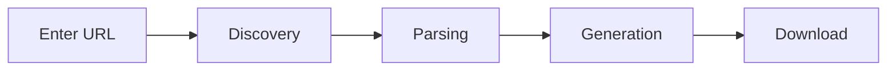

# How It Works

Understand the llms.txt standard and how LLMs Forge processes documentation.

---

## The llms.txt Standard

Many modern documentation sites provide their content in a machine-readable format designed for AI consumption. This is typically available at:

| Endpoint | Description |
|----------|-------------|
| `/llms.txt` | Concise version |
| `/llms-full.txt` | Complete documentation |

These files contain markdown-formatted documentation that AI assistants can easily process.

---

## What LLMs Forge Does

### :material-magnify: 1. Discovery

When you enter a URL, LLMs Forge attempts to fetch:

1. **First:** `{url}/llms-full.txt` (complete documentation)
2. **Fallback:** `{url}/llms.txt` (concise version)

### :material-scissors-cutting: 2. Parsing

The raw content is parsed into sections based on markdown headers:

- `##` headers become individual document boundaries
- Each section becomes its own `.md` file
- Clean filenames are generated from section titles

### :material-file-document-multiple: 3. Generation

LLMs Forge generates three types of output:

-   **Individual Files**

    ---
    
    Each major section becomes a separate markdown file. For example, a "Getting Started" section becomes `getting-started.md`.

-   **llms-full.md**

    ---
    
    A consolidated document containing all sections with a table of contents for easy navigation.

-   **AGENT-GUIDE.md**

    ---
    
    Instructions for AI assistants: what the docs cover, file list, reading order, and source URL.

### :material-download: 4. Download

You can download:

- :material-file: Individual files one at a time
- :material-archive: Everything bundled as a ZIP archive

---

## The "Secret"

!!! info "Full Transparency"
    You can get llms.txt content directly by visiting the URL yourself. Just add `/llms-full.txt` to most documentation sites.

LLMs Forge adds value by:

- :material-auto-fix: Automatically finding the right file
- :material-scissors-cutting: Splitting content into organized sections
- :material-robot: Creating an agent-friendly guide
- :material-package-variant: Bundling everything for easy download

It's a simple tool that does a simple thing well.

---

## Supported Sites

!!! success "Compatibility"
    Any site that provides `/llms.txt` or `/llms-full.txt` will work. This includes many popular documentation platforms and developer tools.
