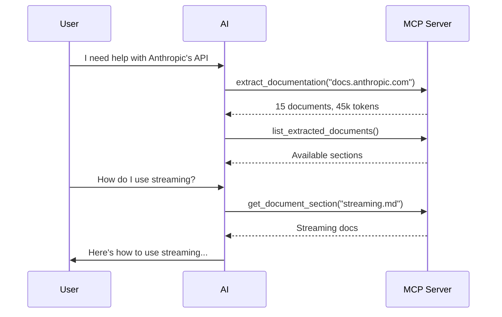

# MCP Server

LLMs Forge includes a fully functional MCP (Model Context Protocol) server that allows AI assistants like Claude to extract and access documentation programmatically.

---

## What is MCP?

The Model Context Protocol (MCP) is an open standard that enables AI assistants to interact with external tools and data sources.

<div class="grid cards" markdown>

-   :material-download:{ .lg .middle } **Extract**

    ---

    Extract documentation from any llms.txt-compatible website

-   :material-format-list-bulleted:{ .lg .middle } **Parse**

    ---

    Structure content into manageable sections

-   :material-file-document:{ .lg .middle } **Access**

    ---

    Retrieve specific documentation sections on demand

-   :material-robot:{ .lg .middle } **Guide**

    ---

    Get AI-optimized guides for using the documentation

</div>

---

## Installation

=== "npx (Recommended)"

    No installation required - just configure your AI client:

    ```json
    {
      "mcpServers": {
        "llms-forge": {
          "command": "npx",
          "args": ["-y", "@llms-forge/mcp-server"]
        }
      }
    }
    ```

=== "Global Install"

    ```bash
    npm install -g @llms-forge/mcp-server
    ```

    Then configure:

    ```json
    {
      "mcpServers": {
        "llms-forge": {
          "command": "llms-forge-mcp"
        }
      }
    }
    ```

=== "Local Development"

    ```bash
    cd llms-forge/mcp-server
    npm install
    npm run build
    ```

---

## Configuration

=== "Claude Desktop"

    Add to your Claude Desktop configuration:

    | OS | Path |
    |----|------|
    | macOS | `~/Library/Application Support/Claude/claude_desktop_config.json` |
    | Windows | `%APPDATA%\Claude\claude_desktop_config.json` |

    ```json
    {
      "mcpServers": {
        "llms-forge": {
          "command": "npx",
          "args": ["-y", "@llms-forge/mcp-server"]
        }
      }
    }
    ```

=== "VS Code Copilot"

    Add to your workspace settings or MCP configuration:

    ```json
    {
      "llms-forge": {
        "command": "npx",
        "args": ["-y", "@llms-forge/mcp-server"]
      }
    }
    ```

---

## Available Tools

### :material-file-download: `extract_documentation`

Extract and parse documentation from a website with llms.txt support.

=== "Input"

    ```json
    {
      "url": "docs.anthropic.com"
    }
    ```

=== "Output"

    - Extraction summary
    - List of parsed documents with token counts
    - Statistics (processing time, document count, total tokens)

!!! info "Caching"
    After extraction, the documentation is cached for quick access via other tools.

---

### :material-file-outline: `fetch_llms_txt`

Fetch raw llms.txt content without parsing. Useful for quick access or custom processing.

=== "Input"

    ```json
    {
      "url": "stripe.com"
    }
    ```

=== "Output"

    - Source URL that was fetched
    - Raw markdown content

---

### :material-file-search: `get_document_section`

Retrieve a specific document section by filename.

=== "Input"

    ```json
    {
      "url": "docs.anthropic.com",
      "filename": "getting-started.md"
    }
    ```

=== "Output"

    - Markdown content of the requested section

!!! warning "Prerequisite"
    Requires `extract_documentation` to be run first.

---

### :material-format-list-bulleted: `list_extracted_documents`

List all available document sections from a previously extracted URL.

=== "Input"

    ```json
    {
      "url": "docs.anthropic.com"
    }
    ```

=== "Output"

    - URL information
    - List of all documents with filenames, titles, and token counts
    - Special files (llms-full.md, AGENT-GUIDE.md)

---

### :material-file-document-multiple: `get_full_documentation`

Get the complete consolidated documentation with table of contents.

=== "Input"

    ```json
    {
      "url": "docs.anthropic.com"
    }
    ```

=== "Output"

    - Complete `llms-full.md` content

---

### :material-robot: `get_agent_guide`

Get the AI agent usage guide with instructions for working with the documentation.

=== "Input"

    ```json
    {
      "url": "docs.anthropic.com"
    }
    ```

=== "Output"

    - `AGENT-GUIDE.md` content with:
        - Source information
        - File list with descriptions
        - Usage instructions
        - Recommended reading order

---

## Example Workflow

Here's a typical workflow for an AI assistant using the MCP server:



### Step-by-Step

1. **Extract Documentation**
    ```
    User: "I need help with Anthropic's API"
    AI uses: extract_documentation({ "url": "docs.anthropic.com" })
    Result: Extracts 15 documents, 45,000 tokens total
    ```

2. **Review Available Sections**
    ```
    AI uses: list_extracted_documents({ "url": "docs.anthropic.com" })
    Result: Lists all available sections
    ```

3. **Get Specific Information**
    ```
    User: "How do I use streaming?"
    AI uses: get_document_section({ "url": "docs.anthropic.com", "filename": "streaming.md" })
    ```

---

## Resource Access

The MCP server also exposes extracted documentation as resources through the MCP resource protocol.

| URI Pattern | Example |
|-------------|---------|
| Full docs | `llms-forge://docs.anthropic.com/full` |
| Agent guide | `llms-forge://docs.anthropic.com/guide` |
| Section | `llms-forge://docs.anthropic.com/getting-started.md` |

---

## Caching

!!! note "In-Memory Cache"
    Extracted documentation is cached in memory during the server session:
    
    - First extraction fetches from the source website
    - Subsequent requests use the cached version
    - Cache persists until the server restarts
    
    To refresh documentation, restart the MCP server.

---

## Troubleshooting

??? question "\"No extraction found for URL\""

    Run `extract_documentation` first before using other tools.

??? question "\"No llms.txt found\""

    The target website doesn't have llms.txt support. Not all websites provide this file.

??? question "Server won't start"

    Ensure Node.js 18+ is installed:
    ```bash
    node --version
    ```

??? question "Connection issues"

    Check your MCP client configuration and ensure the command path is correct.

---

## Development

The MCP server source code is located at `llms-forge/mcp-server/`.

```bash
cd llms-forge/mcp-server
npm install
npm run build

# Or run with auto-rebuild
npm run dev
```

---

## Contributing

Contributions are welcome! See the main repository for contribution guidelines.
