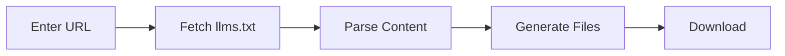

# Overview

How llm.energy works.

---

## The llms.txt Standard

Many documentation sites provide their content in a machine-readable format at `/llms.txt` or `/llms-full.txt`. This format is designed for AI consumption.

| Endpoint | Description |
|----------|-------------|
| `/llms.txt` | Concise version |
| `/llms-full.txt` | Complete documentation |

---

## How It Works

### 1. Fetch

llm.energy fetches:

1. `{url}/llms-full.txt` (complete documentation)
2. Falls back to `{url}/llms.txt` if full version unavailable

### 2. Parse

Content is split into sections based on markdown headers:

- `##` headers become document boundaries
- Each section becomes its own `.md` file
- Filenames are generated from section titles

### 3. Generate

Three types of output:

| File | Description |
|------|-------------|
| `*.md` | Individual section files |
| `llms-full.md` | Consolidated document with TOC |
| `AGENT-GUIDE.md` | Instructions for AI assistants |

---

## Supported Sites

Any site that provides `/llms.txt` or `/llms-full.txt` will work:

- [modelcontextprotocol.io](https://modelcontextprotocol.io)
- [docs.anthropic.com](https://docs.anthropic.com)
- [docs.stripe.com](https://docs.stripe.com)
- And many more...
